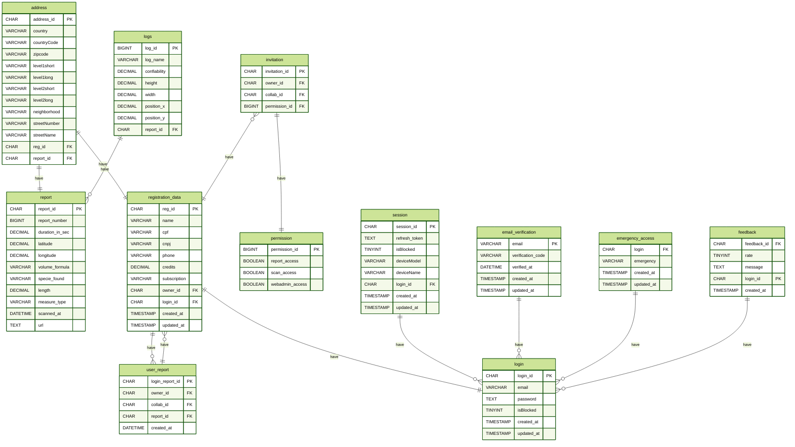

# Descrição do banco de dados (Diagrama ERD)

```mermaid
%%{
    init: { 
        'logLevel': 'debug', 
        'theme': 'forest'
    } 
}%%
erDiagram
    address ||--|| report : have
    address ||--|| registration_data : have
    address{
        CHAR address_id PK
        VARCHAR country
        VARCHAR countryCode
        VARCHAR zipcode
        VARCHAR level1short
        VARCHAR level1long
        VARCHAR level2short
        VARCHAR level2long
        VARCHAR neighborhood
        VARCHAR streetNumber
        VARCHAR streetName
        CHAR reg_id FK
        CHAR report_id FK
    }

    registration_data ||--|| login : have
    registration_data {
        CHAR reg_id PK
        VARCHAR name
        VARCHAR cpf
        VARCHAR cnpj
        VARCHAR phone
        DECIMAL credits
        VARCHAR subscription
        CHAR owner_id FK
        CHAR login_id FK
        TIMESTAMP created_at
        TIMESTAMP updated_at
    }

    invitation ||--|| permission : have
    invitation }o--|| registration_data : have
    invitation {
        CHAR invitation_id PK
        CHAR owner_id FK
        CHAR collab_id FK
        BIGINT permission_id FK
    }

    permission {
        BIGINT permission_id PK
        BOOLEAN report_access
        BOOLEAN scan_access
        BOOLEAN webadmin_access
    }

    report {
        CHAR report_id PK
        BIGINT report_number
        DECIMAL duration_in_sec
        DECIMAL latitude
        DECIMAL longitude
        VARCHAR volume_formula
        VARCHAR specie_found
        DECIMAL length
        VARCHAR measure_type
        DATETIME scanned_at
        TEXT url
    }

    logs ||--o{ report : have
    logs {
        BIGINT log_id PK
        VARCHAR log_name
        DECIMAL confiability
        DECIMAL height
        DECIMAL width
        DECIMAL position_x
        DECIMAL position_y
        CHAR report_id FK
    }

    user_report ||--o{ registration_data : have
    registration_data ||--o{ user_report : have
    user_report {
        CHAR login_report_id PK
        CHAR owner_id FK
        CHAR collab_id FK
        CHAR report_id FK
        DATETIME created_at
    }

        login {
        CHAR login_id PK
        VARCHAR email
        TEXT password
        TINYINT isBlocked
        TIMESTAMP created_at
        TIMESTAMP updated_at
    }

    session ||--o{ login : have
    session {
        CHAR session_id PK
        TEXT refresh_token
        TINYINT isBlocked
        VARCHAR deviceModel
        VARCHAR deviceName
        CHAR login_id FK
        TIMESTAMP created_at
        TIMESTAMP updated_at
    }

    email_verification ||--o{ login : have
    email_verification {
        VARCHAR email PK
        VARCHAR verification_code
        DATETIME verified_at
        TIMESTAMP created_at
        TIMESTAMP updated_at
    }

    emergency_access ||--o{ login : have
    emergency_access {
        CHAR login FK
        VARCHAR emergency
        TIMESTAMP created_at
        TIMESTAMP updated_at
    }

    feedback ||--o{ login : have
    feedback {
        CHAR feedback_id FK
        TINYINT rate 
        TEXT message
        CHAR login_id PK
        TIMESTAMP created_at
    }
```
